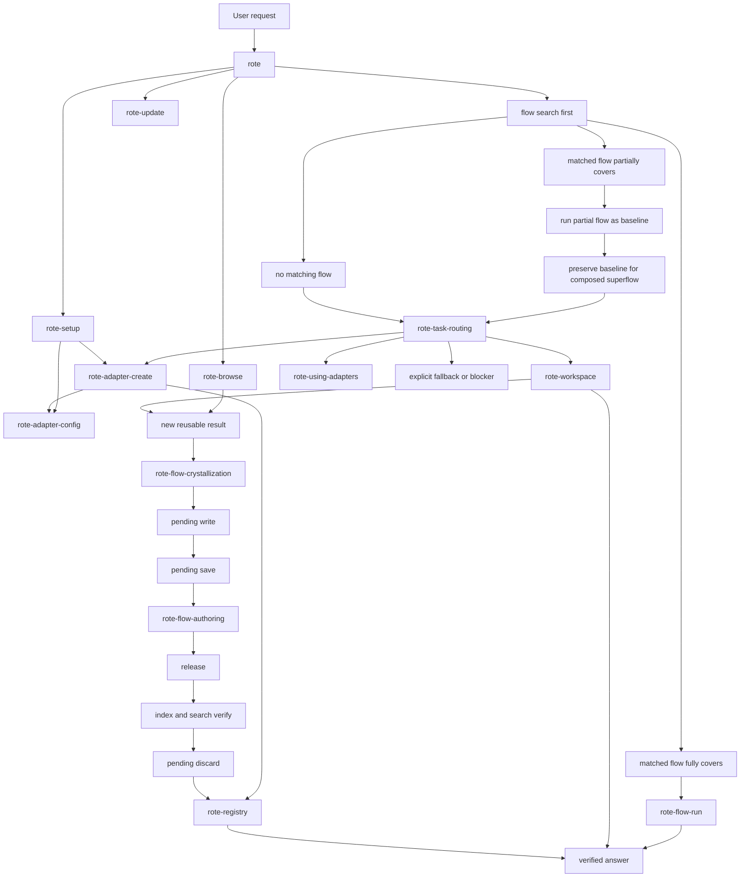

# Rote Skill Workflow Map

This reference is the detailed companion graph for the bundled rote skill set. Load it only when
`rote/SKILL.md`'s short routing table is not enough to choose a skill, define a handoff packet, or
resume a long-running workflow.

`INDEX.md` is package and install-facing documentation. It helps humans and tests sanity-check the
installed set, but active task context starts at `../SKILL.md` and then moves to named companion
skills. Workflow references are intentionally not task owners; workflow logic lives in standalone
skills.

## Companion Graph

| Skill or reference | Owns | May hand off to | Returns | Stop condition |
| --- | --- | --- | --- | --- |
| `rote` | Entry rule, flow-search-first gate, top-level route, platform adaptation, standard packet. | Any bundled companion skill, starting with `rote-flow-run`, `rote-task-routing`, and `rote-workspace` for daily execution. | User or another top-level route. | A companion owns the next step, a flow fully satisfies the task, or a blocker needs user input. |
| `rote-flow-run` | Matched-flow execution, parameter mapping, output verification, full-flow termination, and partial-baseline preservation. | `rote-task-routing`, `rote-flow-crystallization`, `rote-troubleshooting`. | `rote` with flow name/path/parameters, execution command, output artifact, coverage, and verification result. | Flow fully answers with no next skill, partially answers, cannot safely run, or lacks required parameters. |
| `rote-task-routing` | Explore/catalog gates, subagent-before-workspace decisions, adapter route selection, and fallback boundary after no full flow match or a partial baseline. It does not own execution or completion. | `rote-flow-run`, `rote-workspace`, `rote-using-adapters`, `rote-adapter-create`, `rote-troubleshooting`. | `rote` with selected route, checked sources, baseline preservation, and next owner. | A route owner is selected, a verified full-flow result should return to `rote`, no safe rote route exists, or approval/credential input is required. |
| `rote-workspace` | Workspace init/entry for no-flow or partial-flow work, model identity, sequential commands, cached response preservation, recovery, and handoff summaries. | `rote-flow-run`, `rote-flow-crystallization`, `rote-troubleshooting`, `rote-registry`. | `rote` or delegating skill with workspace path, commands run, response IDs, result, save gate, and next owner. | Workspace result completes, a verified full-flow result makes workspace execution not applicable, state cannot be recovered, or a required approval/credential blocks. |
| `rote-shell` | Local CLI/files/logs/process work through `rote proc` and `rote deps`, process evidence capture, background leases, dependency preflight, and shell-derived flow crystallization. | `rote-flow-crystallization`, `rote-flow-authoring`, `rote-typescript-transformations`, `rote-browse`, `rote-troubleshooting`. | `rote` or the delegating skill with commands run, response IDs, process leases, captured artifacts, result, cleanup state, and next owner. | Shell result is delivered, dependency provisioning needs approval, a cleanup/credential prompt blocks, browser/API ownership is required, or flow authoring takes over. |
| `rote-flow-crystallization` | Pending write/save lifecycle, reusable-result save/discard decisions, and pending stub recovery for new or changed workflow knowledge. | `rote-flow-authoring`, `rote-registry`, `rote-troubleshooting`. | Caller with pending stub, scaffold command, save decision, and release recommendation. | Stub is saved or discarded, unchanged released-flow reuse makes the save gate not applicable, decision is unclear, pending state is unrecoverable, or authoring owns the next step. |
| `rote-flow-authoring` | Flow contract elicitation, rote-driven schema discovery, scaffold, implementation, tests, lint, release, index, search verification, pending cleanup, and registry-ready handoff. | `rote-typescript-transformations`, `rote-registry`, `rote-flow-run`, `rote-troubleshooting`. | Caller with flow path, parameter contract, verification status, release state, pending cleanup state, and next owner. | Flow is verified and pending cleanup is complete, release/publish approval is needed, required schema/credential is missing, or troubleshooting owns recovery. |
| `rote-command-patterns` | Task-focused command idioms after live grammar/guidance, including quoting, cwd, response IDs, registry, and browser command shapes. | `rote-workspace`, `rote-flow-authoring`, `rote-typescript-transformations`, `rote-registry`, `rote-browse`, `rote-troubleshooting`. | Owning skill with command pattern, caveats, live source checked, and resume point. | The owner has enough syntax, live grammar supersedes this guidance, or troubleshooting is needed. |
| `rote-typescript-transformations` | TypeScript flow logic, cached-response transformation, `FlowOutput` shape, execution rules, SDK import guidance, and transformation tests. | `rote-flow-authoring`, `rote-workspace`, `rote-command-patterns`, `rote-troubleshooting`. | Caller with input response IDs, transformation path, output shape, tests, and blockers. | Transformation is tested, jq is sufficient, required data is missing, or troubleshooting owns recovery. |
| `rote-troubleshooting` | Repeated-failure diagnosis, no-blind-retry recovery, state inspection, route changes, and return-to-owner handoffs. | Original owning skill, `rote-command-patterns`, `rote-adapter-config`, `rote-setup`. | Owning skill with cause, material change, remaining blocker, and resume point. | Cause changes, route changes, user approval/credential is needed, or no rote path remains. |
| `rote-setup` | Install, login, first adapters, credential checks, first value proof. | `rote-adapter-create`, `rote-adapter-config`, `rote-registry`, `rote-update`, `rote`. | `rote` with binary path, signed-in identity, adapters, credentials, skill target, proof result, and skipped/blocking setup steps. | CLI-only stop is chosen, setup proof completes, command failure needs a branch decision, or a required human credential/action blocks. |
| `rote-adapter-create` | Spec discovery, dry-run, auth research, toolset selection, create, post-create choices, and readiness probe. | `rote-adapter-config`, `rote-registry`, `rote-setup`, `rote`. | Caller with adapter id, spec source, dry-run summary, auth/toolset decisions, create/probe result, credential state, and next owner. | Dry-run fails, create/probe completes, credential/browser action is pending, or another skill owns the next step. |
| `rote-adapter-config` | Existing-adapter show/confirm/apply/re-show loop and honest limits. | `rote-adapter-create`, `rote-troubleshooting`, `rote`. | Caller with adapter id, setting changed, command run, verification output, skipped operation, and pending credential/browser action. | Requested setting is verified, user declines, a credential/browser action blocks, or recreation is required. |
| `rote-using-adapters` | Delegated single-adapter execution, probe/call/query loop, write guard, pending stub, and return summary. Prefer `rote-workspace` for ordinary main-conversation execution. | `rote`, `rote-workspace`, `rote-flow-crystallization`, `rote-registry`. | `rote` or delegating skill with workspace, response IDs, result, write-guard state, save gate, blockers, and next owner. | Task completes, adapter cannot satisfy it, write approval or credential is missing, or save/release approval is unresolved. |
| `rote-registry` | Registry auth, org/owner selection, existence checks, dry-run push, visibility, conflicts, usage, and invites. | `rote-org`, `rote-adapter-create`, `rote-flow-crystallization`, `rote-flow-authoring`, `rote`. | Caller with artifact kind/id/path, owner, visibility, dry-run verdict, push or skip reason, version/conflict state, invite results, and next owner. | Artifact is shared or in sync, auth/org/quota blocks, visibility is unconfirmed, or authoring/creation must resume. |
| `rote-org` | Standalone organization administration, member roles, invites, pending invites, usage, and plan visibility. | `rote-registry`. | Caller with org slug, operation run, before/after member or invite state, role/quota result, permission blocker, and next registry action. | Admin task completes, privileges/quota are insufficient, destructive confirmation is missing, or registry publication should resume. |
| `rote-browse` | Browser launch choice, page leases, snapshots, slices, waits, human gates, saved auth, replay, and browser flow caveats. | `rote-flow-crystallization`, `rote-flow-authoring`, `rote-registry`, `rote`. | Caller with workspace, lease/session, launch mode, snapshot/page refs, human-gate status, saved-auth state, result, replayability signal, and next owner. | Browser result is delivered, human gate blocks, page lease is unrecoverable, action needs approval, or flow crystallization owns the next step. |
| `rote-update` | Binary update check, self-update, version confirmation, skill refresh, provider target, and restart guidance. | `rote-setup`, `rote`. | Caller with old/new version when known, update result, skill refresh status, provider target, restart requirement, and manual-update blocker. | Update/check completes, self-update defers to another installer, skill refresh finishes, or restart/manual action is required. |

## Companion Handoff Requirements

These companion skills use the same contract shape as the standalone workflow skills.

| Skill | Handoff contract focus | Packet required | Markdown summary required |
| --- | --- | --- | --- |
| `rote-setup` | Install/login/adapters/credentials/proof, then return to daily `rote` use. | No, unless delegating to a workspace/subagent skill. | No. |
| `rote-adapter-create` | Dry-run/create/probe, with returns to setup, config, registry, or daily use. | Yes, when returning a created adapter or blocked create state. | No. |
| `rote-adapter-config` | Show/confirm/apply/re-show loop and recreation fallback. | No. | No. |
| `rote-using-adapters` | Delegated single-adapter work, write guard, response IDs, and save gate. | Yes. | Yes. |
| `rote-registry` | Artifact share, org target, visibility, conflict, invite, and return data. | No, unless receiving one from creation/authoring. | No. |
| `rote-org` | Standalone org mutation/read result and registry return. | No. | No. |
| `rote-browse` | Browser lease/session, human gates, snapshots, saved auth, and replayability. | Yes. | Yes. |
| `rote-update` | Binary update, skill refresh, version, provider target, and restart guidance. | No. | No. |

## Standalone Workflow Skills

These names are the discoverable workflow handoff targets. Former task references are standalone
skills so runtime discovery can activate each owner directly.

| Skill | Entry trigger | Return fields |
| --- | --- | --- |
| `rote-flow-run` | A flow search result may satisfy all or part of the request. | Flow name, path, parameters, command, output artifact, coverage, verification result. |
| `rote-task-routing` | Flow search did not fully cover the request. | Selected route, adapter/catalog/subagent decision, checked sources, next skill. |
| `rote-workspace` | Adapter work needs workspace state, cached responses, transformations, or subagent re-entry. | Workspace path, commands run, response IDs, result, reusability signal, handoff summary. |
| `rote-flow-crystallization` | Workspace/browser/manual work produced reusable results. | Pending stub, save/discard decision, release recommendation. |
| `rote-flow-authoring` | User asks to create, edit, lint, release, or publish a flow. | Flow path, validation output, release status, registry next step. |
| `rote-command-patterns` | Live `rote grammar` is insufficient for task-focused command idioms. | Command pattern used, caveats, current grammar source. |
| `rote-typescript-transformations` | TypeScript flow logic or cached-response transformation is needed. | Input response IDs, transformation path, `FlowOutput` shape, tests. |
| `rote-troubleshooting` | A rote command or workflow failed repeatedly without changed inputs. | Cause, changed route or command, remaining blocker, return skill. |

## Standard Handoff Packet

Use this shape whenever one skill asks another skill, workspace, or subagent to take over. Keep it
short and factual; omit fields only when they truly do not apply.

```markdown
## Handoff Packet

- Origin skill: `rote` or `rote-...`
- Target skill: `rote-...`
- User intent: ...
- Current state: flow search result, adapter/workspace state, registry/setup state, or browser state
- Preconditions satisfied: commands run, approvals granted, credentials verified, files written
- Workspace path: ... or none
- Cached responses: `@N` ids and what each contains
- Process leases or captured artifacts: ...
- Requirements: required sources/adapters, capabilities, live observations, artifact, and
  verification checks that must survive interruption, compaction, and handoff
- Allowed commands: exact rote commands or flow paths the target may run
- Stop conditions: unsafe action, missing credential, failed precondition, user approval needed
- Return fields: result, artifacts, response IDs, save gate, next recommended skill
```

## Handoff Summary Shape

Workspace-bound and subagent-capable skills should write or return this lightweight markdown summary
when work needs to survive handoff or compaction.

```markdown
# Rote Handoff Summary

- Active skill: `rote-...`
- Origin skill: `rote` or `rote-...`
- User intent: ...
- Workspace path: ...
- Commands run: ...
- Cached responses: ...
- Process leases or captured artifacts: ...
- Requirements: ...
- Current gate: ...
- Result or artifact: ...
- Save gate: pending, accepted, discarded, or not applicable
- Next skill: `rote-...` or none
- Blockers: ...
- Completion signal: ...
```

## Lifecycle Map



## Platform Reference Rule

Platform references translate a workflow action into a runtime tool. They do not own task state and
they do not replace the active skill's handoff contract. Load exactly one platform reference when a
runtime-specific question is blocking progress; otherwise keep routing in `../SKILL.md` and the
owning companion skill.
