# rote - Entrypoint Orchestrator

Use `rote` first when a task may involve adapters, plays, browser automation, local shell or
process work that should be remembered, registry work, setup/update actions, or reusable workflow
state. This skill owns the first routing decision; the narrower companion skills own their
specialist workflows.

Every `rote-<name>` reference in this skill set is a **skill**, never a CLI command —
`rote-shell` is not `rote shell`, and `rote-adapter-config` is not `rote adapter config`. Invoke
skills through the runtime's skill mechanism; only literal `rote …` commands run in the terminal.

## The rote Skill Rule

If there is any reasonable chance the task needs rote, load and follow this skill before direct
MCP calls, provider CLIs, browser automation, registry commands, or custom scripts.

- Start day-to-day work with `rote play search "<intent>"`; a reusable local Play may already
  exist. If local search has no verified full match, run
  `rote play search "<intent>" --source registry` before accepting a partial baseline, exploring,
  or building a replacement. Registry search defaults to every Play accessible to the current
  session; use `--scope public` for identity-independent output. Load
  [Play Search And Run](references/flow-search-and-run.md) when choosing or executing a result.
- When search does not return a verified full-play match, invoke the `rote-task-routing` skill
  before `rote-shell`, `rote-flow-authoring`, raw HTTP, native CLIs, or custom scripts unless the
  user's request is explicitly only local CLI/files/logs/process work.
- When rote commands fail repeatedly, invoke the `rote-troubleshooting` skill and fix the cause.
  Do not record a memory, note, or instruction to avoid rote for this task class — a failed run
  is a configuration or routing problem to repair, not a verdict on the tool.
- If a companion skill is the better owner, invoke that skill deliberately instead of continuing
  from general prose.
- Run rote commands one at a time, read each result fully, and obey `@@status`, `@@next`,
  `@@mandatory`, `@@plays`, cached response IDs, warnings, and errors before choosing the next
  command. Captured shell chains such as `rote proc run ... && rote proc run ...` belong to
  `rote-shell`; use them only when each meaningful process is captured as its own `rote proc`
  response in the workspace DAG.
- After `rote init --seq`, enter the workspace first, then record the confirmed current model with
  `rote model set <model-or-family> --provider <provider> --confirmed-current`, then initialize the
  session. If model identity is not visible, skip it rather than guessing.
- Before installing a catalog adapter, inspect related installed adapters. If an installed adapter
  matches the provider/capability but has a wrong `base_url`, auth, or config, run
  `rote adapter info`, dry-run the candidate repair with `rote adapter set <id> base_url <url>
  --dry-run`, then apply and probe/call the installed adapter through rote.
- A successful `--dry-run` is analysis only, not setup completion. Do not answer or proceed as if an
  adapter, play, registry push, or runtime action exists until the non-dry-run command has run and
  the installed/released/published state is verified.
- `[MANDATORY PROTOCOL] no pending stub` is a hard final-answer stop until the reusable result enters
  `rote-flow-crystallization`. Adapter, browser, and mixed work must complete pending write/save;
  process-only work must complete the crystallization plan and save decision before adapterless
  export. Never invent an adapter to silence the warning.
- For reusable multi-source work, confirm each required source is backed by a captured `@N`
  response before presenting or releasing; release/lint success is not provider proof.
- Use `rote how`, `rote start`, `rote guidance agent essential`, `rote guidance adapters
  essential`, and `rote grammar <topic>` for live CLI guidance when the user asks how rote works.

## Reuse Triage Gate

After rote work that was not unchanged execution of an existing released play, classify the procedure
before final answer. Do not treat a one-off user request as non-reusable. One-off describes the
current need; reusable describes whether the procedure has parameterizable inputs, repeatable
adapter/browser/shell steps, a stable output shape, and future agent value.

If reusable or plausibly reusable, invoke `rote-flow-crystallization` before final presentation;
it owns the semantic plan, save/discard decision, and route to pending write/save or adapterless
export. If not reusable, briefly record why.

## Default Play Shape

When work is crystallized, no shape flags means the schema-v1 steps + presentation model: adapter,
`process.exec`, and browser effects live in frontmatter `steps:`, while
`metadata.execution_model: steps_with_presentation` selects a deprivileged TypeScript renderer.
Schema v2 remains an explicit `--scheme 2` opt-in. Explicit `--with-steps` (template) or
`--format steps` (export) is steps-only; `--legacy-body` or a deliberate shell/no-steps route is the
legacy escape: take it only when the workflow needs control flow or runtime interaction the step
language does not support, or when the user explicitly asks for a no-steps body. Runtime-discovered
fan-out, conditions, ordering, parallelism, and long finite commands are steps capabilities
(`for_each`, `execution:`, `depends_on`, `max_concurrency`, `timeout_ms`) — a set whose width is
only discovered at run time is not a legacy trigger.
Every play containing `steps:` runs with `rote play run`; only no-steps legacy
TypeScript uses `rote deno run --allow-all`. For the concrete step syntax use `rote grammar steps`;
the complete assembled artifact lives in `rote guidance typescript play-creation`.

## Requirements Across Interruptions

For long, interrupted, partial-play, or reusable work, note the requirements before execution
starts:

- Required sources/adapters and the capability each one must provide.
- Required live observations, output artifact, and verification checks.
- Constraints that must survive compaction, interruption, and superplay composition.

After compaction, a user interruption, or a handoff, reread that note before the next command. Do
not substitute adjacent data for a missing capability: provider metadata is not live activity, event
details are not recent trades, and a baseline report is not the augmented result.

## New User Message During Work

When the user sends a new message mid-task, classify it before acting:

- Same-task refinement: update the requirements note and continue.
- Blocking correction or priority switch: preserve state, switch, and explicitly name whether the
  prior task remains open.
- Independent side question: answer briefly, then resume from the requirements note.
- Ambiguous relationship: ask one clarifying question.

Before answering or switching, write down the current gate, workspace/play name, cached response ids,
pending stub state, artifact path, and exact next rote command. After the side question or
correction, repeat that resume point and continue unless the user explicitly closes the original
task. Decide by semantic relationship, not fixed phrases such as "hold on".

## Instruction Priority

User instructions say what outcome to produce; this skill says how to use rote to produce it.

1. User instructions, project rules, and explicit approvals.
2. The rote lifecycle in this skill.
3. Companion rote skills for the selected state.
4. Live rote command output, grammar, and guidance for exact syntax.
5. General model defaults.

If the user asks to save, release, publish, make reusable, or crystallize a workflow, treat that as
approval for the save/release path. It does not waive the crystallization plan, applicable pending
write/save, materialization, test, release, index, search, or cleanup states.

## Skill Play

```dot
digraph rote_flow {
    "User request" [shape=doublecircle];
    "Explicit setup/update/browser/org/registry?" [shape=diamond];
    "Invoke specialist" [shape=box];
    "Search local, then registry Plays" [shape=box];
    "Full play match?" [shape=diamond];
    "Partial play match?" [shape=diamond];
    "Run matched play" [shape=box];
    "Run partial play as baseline" [shape=box];
    "Preserve baseline for superplay" [shape=box];
    "Full play reuse terminal" [shape=doublecircle];
    "Route uncovered work" [shape=box];
    "Run rote explore <intent>" [shape=box];
    "Substrate route" [shape=box];
    "Execute in rote workspace" [shape=box];
    "Execute via rote-shell" [shape=box];
    "Verify requested artifact/content" [shape=box];
    "Reusable result?" [shape=diamond];
    "Build crystallization plan" [shape=box];
    "Pending supported?" [shape=diamond];
    "Pending write" [shape=box];
    "Pending save" [shape=box];
    "Save/release approved?" [shape=diamond];
    "Ask one yes/no save question" [shape=box];
    "Materialize draft" [shape=box];
    "Test, lint, release" [shape=box];
    "Index and search verify" [shape=box];
    "Pending discard" [shape=box];
    "Registry decision if sharing requested" [shape=box];
    "Present verified Play URI and sharing guidance" [shape=box];
    "Final answer" [shape=doublecircle];

    "User request" -> "Explicit setup/update/browser/org/registry?";
    "Explicit setup/update/browser/org/registry?" -> "Invoke specialist" [label="yes"];
    "Explicit setup/update/browser/org/registry?" -> "Search local, then registry Plays" [label="no"];
    "Invoke specialist" -> "Verify requested artifact/content";
    "Search local, then registry Plays" -> "Full play match?";
    "Full play match?" -> "Run matched play" [label="yes"];
    "Full play match?" -> "Partial play match?" [label="no"];
    "Run matched play" -> "Verify requested artifact/content";
    "Partial play match?" -> "Run partial play as baseline" [label="yes"];
    "Partial play match?" -> "Run rote explore <intent>" [label="no"];
    "Run partial play as baseline" -> "Preserve baseline for superplay";
    "Preserve baseline for superplay" -> "Route uncovered work";
    "Route uncovered work" -> "Run rote explore <intent>";
    "Run rote explore <intent>" -> "Substrate route";
    "Substrate route" -> "Execute in rote workspace" [label="adapter/API"];
    "Substrate route" -> "Execute via rote-shell" [label="local CLI/files/logs"];
    "Execute in rote workspace" -> "Verify requested artifact/content";
    "Execute via rote-shell" -> "Verify requested artifact/content";
    "Verify requested artifact/content" -> "Full play reuse terminal" [label="verified full play"];
    "Verify requested artifact/content" -> "Reusable result?" [label="workspace/browser/manual result"];
    "Reusable result?" -> "Final answer" [label="no"];
    "Reusable result?" -> "Build crystallization plan" [label="yes"];
    "Build crystallization plan" -> "Pending supported?";
    "Pending supported?" -> "Pending write" [label="adapter/browser/mixed"];
    "Pending supported?" -> "Save/release approved?" [label="process-only"];
    "Pending write" -> "Pending save";
    "Pending save" -> "Save/release approved?";
    "Save/release approved?" -> "Materialize draft" [label="yes"];
    "Save/release approved?" -> "Ask one yes/no save question" [label="no"];
    "Ask one yes/no save question" -> "Final answer";
    "Materialize draft" -> "Test, lint, release";
    "Test, lint, release" -> "Index and search verify";
    "Index and search verify" -> "Pending discard";
    "Pending discard" -> "Registry decision if sharing requested";
    "Registry decision if sharing requested" -> "Final answer" [label="local only"];
    "Registry decision if sharing requested" -> "Present verified Play URI and sharing guidance" [label="published"];
    "Present verified Play URI and sharing guidance" -> "Final answer";
}
```



## Skill Priority

When multiple rote skills could apply, use this order:

### Substrate Router: Adapter vs Browser vs Shell

After the initial play search, choose the substrate that best matches the user's intent. Do not
force all tasks through adapters, browser automation, or shell.

| Intent signal | Route |
| --- | --- |
| API objects, tickets, PRs, issues, CRM records, calendar data, databases, provider data | Use rote adapters first. |
| "browse", "open this site", "attach to my browser", "use the page", "click", "type", "snapshot", "extract from the page", social/profile page extraction, Gmail/browser login, SSO/MFA, active tab state | Invoke the `rote-browse` skill. |
| Local CLI, files, logs, commands, build/test/release checks, generated artifacts | Invoke the `rote-shell` skill; it owns `rote proc` and `rote deps`. |
| API result feeds a CLI or CLI result feeds an API | Keep one workspace and combine adapter calls with the `rote-shell` skill. |
| Browser snapshot/file feeds a local CLI | Keep one workspace, use the `rote-browse` skill first, then `rote-shell` on the saved evidence. |

Provider/API data is not shell work merely because `curl`, Python, Node, or a public REST endpoint
can fetch it. After play search, route through `rote-task-routing`; if no installed adapter fits,
search/install from the adapter catalog before direct fallback.

Browser routing rule:

- Browser words outrank domain nouns. "Browse my calendar" routes to `rote-browse` after the
  initial play search, even though calendar data can be an adapter task. Use an adapter/play only if
  it is already installed, healthy, and completes the request. If it is missing, stale,
  unauthenticated, or fails setup, switch to browser attach instead of asking the user to build an
  adapter first.
- Browser words also outrank native web search. If the user asks to browse or extract public pages,
  use `rote-browse` for page observation/extraction. Native search may discover candidate URLs only
  when explicitly requested or when no URL can be found through adapter/CLI evidence; it is not a
  replacement for browser snapshots and page extraction.
- If the user needs existing login, Gmail, SSO, MFA, extensions, active tabs, or profile state, ask
  whether to attach to an existing headed browser.
- If the work is public, read-only, CI, or replay-like, ask whether a headless new session is
  acceptable.
- If the user says only "browse", ask headed vs headless, then attach-existing vs new session.

Do not satisfy browser intent with native web search, WebFetch, raw `curl`, raw Playwright, `open`,
or `rote proc run` unless the user explicitly switches from browser interaction to a non-browser
substrate.

Shell/process routing rule:

- The `rote-shell` skill owns durable local CLI, files, logs, background processes, dependency
  manifests, and shell-derived play crystallization — but not provider/API data collection: use
  adapters for typed provider calls, and `rote proc` only for local command evidence or
  transformations selected by the router. Its command model and raw-shell boundary live in that
  skill, not here.

1. `rote` first for any day-to-day rote, adapter, MCP, play, workspace, or reusable workflow task.
2. Explicit lifecycle specialists before play search only when the user directly asks for setup,
   update, browser automation, shell/process work, registry, org administration, adapter creation,
   or adapter configuration.
3. `rote-flow-run` before workspace exploration when search or `@@plays` returns a usable play.
4. `rote-task-routing` only to choose the next route after no full play match or after a partial
   play baseline is preserved. Never route the same work again after a verified full play match.
5. `rote-shell` only when the user explicitly asked for local CLI/files/logs/process work or
   `rote-task-routing` selected the shell substrate.
6. `rote-workspace` for adapter probes, calls, cached response queries, transformations, and
   multi-adapter execution.
7. `rote-flow-crystallization` for every new reusable workspace, browser, shell, or manual result
   before final presentation; unchanged reuse of an existing released play skips this gate.
   Process-only work uses the same doctrine and approval gate, then authoring materializes it through
   adapterless export because template/pending still require a real adapter.
8. `rote-flow-authoring` only after direct authoring intent or an approved crystallization plan.
9. `rote-command-patterns` and `rote-typescript-transformations` are helper/reference skills; they
   return to the owner and do not complete the lifecycle themselves.
10. `rote-troubleshooting` after an unchanged retry fails or state recovery is unclear.

## Skill Types

- **Rigid states:** play search, play provenance preservation, workspace execution, pending
  write/save, scaffold, tests, release, index, search verification, pending discard, and full-play
  reuse termination. Follow these exactly.
- **Flexible states:** wording, artifact formatting, adapter choice after routing, parameter naming,
  and registry visibility recommendations. Adapt these to the user request and live rote output.

## User Instructions

The user may name the desired result, adapter, play, output file, or release target. That narrows the
path; it does not skip lifecycle states. If the user asks for a direct adapter/MCP/browser/shell
action, route through rote unless they explicitly forbid rote.

## Red Flags

These thoughts mean stop and return to the current lifecycle state:

| Thought | Reality |
| --- | --- |
| "I know which adapter to use, so I can skip play search." | Search is the entry gate for day-to-day rote work. |
| "A partial play is just a draft; I can rewrite it." | Run it as a reusable baseline, preserve its output/provenance, and build a new composed superplay around it. |
| "A full play answered it, but I should explore adapters to improve it." | Stop after verifying the requested artifact. Existing released play reuse is terminal unless the user asked for a new artifact or edit. |
| "The report looks right, so verification is done." | Verify the requested artifact content and required rote lifecycle evidence. |
| "Rote warned `[MANDATORY PROTOCOL] no pending stub`, but I can answer now." | Stop. For workspace, browser, manual, or mixed shell/API work that produced reusable results, run pending write and pending save before final text. |
| "The user asked for a one-off report, so no save gate." | Wrong. Run reuse triage. One-off request intent does not imply one-off workflow value. |
| "The provider is right, so any adapter for it is enough." | Match the requested capability: metadata, search, trades, live volume, files, and workflow state are different capabilities. |
| "I ran pending write; that is enough." | Pending write anchors context; pending save emits the scaffold command. |
| "The user said save, so pending save is unnecessary." | Save approval starts pending save; it never skips it. |
| "Running an existing released play produced a reusable result, so I need pending write." | No. Pending write is for new or changed workflow knowledge, not unchanged reuse of an existing play. |
| "The play is released, so the pending stub can stay." | Release is followed by index, search verification, then pending discard. |
| "I can edit `status: released` by hand." | Use `rote play release`; it is the lint-gated lifecycle transition. |
| "After compaction, I remember the state." | Recover with rote workspace, response, and pending-state commands before continuing. |
| "After compaction, the immediate next task is all that matters." | Reread the requirements note and preserve every required source, live observation, artifact, and verification check. |
| "No installed adapter means direct curl/WebFetch now." | Explore and adapter catalog search come before direct fallback. |
| "The public API is easy; I can call it with Python, Node, or curl and then hand-write the play." | Provider/API data goes through play search, task-routing, catalog install, adapter probes/calls, pending save, then scaffold. |
| "Single-adapter work does not need workspace discipline." | Adapter probes, calls, and cached responses belong in a rote workspace. |
| "I need shell output, so raw `gh`/`npm`/`python` is fine." | Use `rote-shell` and `rote proc` when the output should be durable, queryable, or replayable. |
| "The user asked something else, so the old task is gone." | Classify the new request, preserve state, answer or redirect, then resume or close the prior task explicitly. |
| "One more pagination pass will find a better match." | Fix a probe budget, satisfice, and reserve room for the artifact, save, and release gates. |
| "I should re-check the type/length of every response before extracting." | Probe structure once per tool, then reuse the known shape. |

Active task routing starts here and then moves to a named companion skill or an explicit reference.

## Platform Adaptation

Rote skills speak in actions: invoke a companion skill, run a rote command, edit a file, dispatch
a subagent, enter a workspace, or ask for approval. Do not assume one runtime's tool names apply
everywhere.

Load the platform reference only when runtime-specific details affect the current step:

| Runtime | Reference | Use it for |
| --- | --- | --- |
| Claude Code | [claude-code-tools.md](references/claude-code-tools.md) | Skill loading, Bash/Edit/Read/Todo/Subagent mapping, and approval prompts. |
| Codex | [codex-tools.md](references/codex-tools.md) | Sandbox rules, shell/file constraints, and skill-loading equivalents. |
| Copilot CLI | [copilot-tools.md](references/copilot-tools.md) | Equivalent action names when Claude/Codex tool names are unavailable. |
| Gemini | [gemini-tools.md](references/gemini-tools.md) | Skill loading, shell/file operations, and instruction-file expectations. |
| Pi | [pi-tools.md](references/pi-tools.md) | Pi runtime skill discovery, tool names, and handoff language. |
| Antigravity | [antigravity-tools.md](references/antigravity-tools.md) | Antigravity tool equivalents and approval posture. |

For the full companion graph, lifecycle edges, and standard packet fields, load
[skill-workflow-map.md](references/skill-workflow-map.md). Keep it out of active context until the
short routing table is not enough.

## Top-Level Skill Routing

Complete the root Play-search gate before invoking the narrow skill that owns the next state: search
locally, then search the registry when no verified full local match exists. Explicit setup, update,
browser, shell/process, registry, org, adapter-create, or adapter-config requests may start in that
specialist skill, but those specialists still return to this lifecycle before final presentation
when reusable workflow state is involved. Workflow logic lives in standalone skills;
`rote/references/` is only for platform mapping, the optional workflow map, and the compact Play
search/run reference.

| Branch | Invoke or load | Completion expectation |
| --- | --- | --- |
| Existing play fully covers the request | `rote-flow-run`. | Play output is verified and delivered; stop unless the user asked for edits, a new artifact, or publication work. |
| Existing play covers a baseline or partial result | `rote-flow-run`, then `rote-task-routing`. | Baseline output is kept intact while uncovered work is routed. |
| Local CLI, files, logs, commands, or process state is the selected substrate | `rote-shell`. | Shell work uses `rote proc`/`rote deps`, records evidence, and returns result plus reusable-work signal. |
| Neither Play provider produced a full or partial match, installed adapter can help | `rote-task-routing`, then `rote-workspace`. | Adapter work runs in a rote workspace with cached response IDs preserved. |
| No installed adapter matched | Search `rote adapter catalog search "<intent>"`; use `rote-adapter-create` if the user supplied or accepts an adapter spec. | Useful catalog hits are inspected or installed before out-of-band fallback. |
| Workspace, browser, or manual work produced new reusable results | `rote-flow-crystallization`. | A semantic plan is persisted through pending write/save before final presentation; save/discard is resolved. |
| Shell/process work produced reusable results | `rote-shell`, then `rote-flow-crystallization`. | The same semantic plan and save decision precede no-shape-flag workspace export; adapter-requiring pending/template commands are not used. |
| User asks to create, edit, lint, release, or publish a play | `rote-flow-authoring`. | The play lifecycle reaches scaffold, tests, lint, release, index/search verification, cleanup, publish, or a clear blocker. |
| Command syntax or rote idioms are needed | Prefer `rote grammar <topic>`; invoke the `rote-command-patterns` skill for task-focused patterns. | Live grammar is treated as source of truth. |
| TypeScript play transformation detail is needed | Prefer `rote grammar deno`; invoke the `rote-typescript-transformations` skill. | Cached responses and `FlowOutput` shape are preserved. |
| Repeated failure appears after an unchanged retry | `rote-troubleshooting`. | The cause changes, the route changes, or the blocker is surfaced. |
| Org, registry, browser, shell/process, or single-adapter execution is explicit | Invoke the matching skill: `rote-org`, `rote-registry`, `rote-browse`, `rote-shell`, or `rote-using-adapters`. | The specialist skill returns its completion signal or next handoff. |

## Execution State Machine

1. State the intent in one phrase and run `rote play search "<intent>"`. If it has no verified full
   local match, run `rote play search "<intent>" --source registry` before classifying the best
   available coverage. Keep each provider's order intact; their ranks are not comparable. Explicit
   setup/update/browser/shell/org/registry/adapter-create/adapter-config requests may start in the
   named specialist instead.
2. If a Play from either provider fully covers the request, run it through `rote-flow-run`. That
   skill owns local callability and the registry card's inspect/install/run path. Verify the requested
   artifact content, and stop. Do not explore adapters, initialize a workspace, rewrite the artifact,
   or enter pending write/save unless the user explicitly asked to edit, create a separate enhanced
   artifact, save a new workflow, release, or publish.
3. After both applicable provider searches, if a Play covers only part of the request, run it as the
   baseline. Preserve the raw baseline output, provenance, sentinels, source labels, and markers as
   source material for a new composed superplay. Route only the uncovered work, then save/release the
   reusable composition if requested or approved. Do not replace the baseline with a hand-written
   lookalike report.
4. If neither provider matched or uncovered work remains, run `rote explore "<intent>"` and obey any
   `@@plays` suggestions before adapter work.
5. Choose the substrate. Route local CLI/files/log/process work to `rote-shell`; route adapter/API
   work through task selection before workspace work.
6. If a generated `rote-<adapter-id>` subagent is the right owner, dispatch it before entering the
   workspace, not midway through execution.
7. If no installed adapter covers adapter/API work, search the adapter catalog before direct
   fallback. Tell the user what rote checked when falling back.
8. Execute adapter work through the workspace path and shell work through `rote-shell`, preserving
   cached `@N` responses, process evidence, session state, and any existing-play baseline output.
   Inspect and transform rote responses with `rote query @N`, `rote query schema`, and `rote proc` rather than
   ad hoc `grep`, `head`, inline Python, or temp-file parsing when the result feeds a report, play,
   or later reasoning step.
9. Verify the requested deliverable by reading content, not just checking that a command exited or a
   file exists. If a workspace was used, also run `cd <workspace-path> && rote ls` before the final
   answer — it emits the `[MANDATORY PROTOCOL]` pending-stub warning when a reusable result has not
   entered the pending lifecycle. Run the command that enforces the save gate instead of relying on
   remembering it.
10. Before presenting any new reusable result, run `rote-flow-crystallization` to produce the
    semantic plan and resolve save/discard. Adapter, browser, and mixed work then use pending
    write/save. Process-only work skips those adapter-requiring commands without skipping the plan.
    If save/release was already requested, continue to authoring without asking again. Do not run
    this gate for unchanged reuse of an existing play.
11. After an approved process-only plan, let `rote-flow-authoring` choose adapterless workspace
    export or a justified legacy no-steps body using shell guidance. Never invent an adapter or
    append shape flags to a pending-save command.
12. After authoring, release with `rote play release`, rebuild the index, verify search, then clear
    the pending stub with `rote play pending discard <workspace>`.
13. When registry publication succeeds or the selected version is already in sync, require
    `rote-registry` to return the exact `play_uri`, `bootstrap_uri`, resolved
    `data.play_inspect.reference`, `data.play_inspect.execution`, published-reference
    `execution_verification` status and evidence, and access guidance (resolution and execution audiences). Present the
    disclosure-only Play URI, advertised bootstrap transition, and resolved `play run` reference as
    separate resources. Static eligibility and inspection never substitute for the exact pinned
    acceptance run; if that run is not authorized or cannot be supplied safe representative inputs,
    label it unverified. A local release has no published Play URI, and no skill should construct or
    parse one.

## Bounded Exploration

Data hunting is a means, not the deliverable. When a request needs "the best/most X" from a large
result space, satisfice: fix a small probe budget up front, take the best candidate found within
it, state the search bounds in the deliverable, and move on to the artifact and crystallization
gates. Delivering a good-enough result end to end beats an exhaustive sweep that leaves no room
for the report, save, and release steps.

- Prefer server-side ordering and filters (`order`, `tag`, `limit`) over client-side pagination
  sweeps. If a couple of ordered, filtered calls do not surface a candidate, take the best so far.
- Probe a response's structure once (a single `keys`/`type` query), then reuse that shape for
  every later response from the same tool.
- Install only the adapters the request needs; a second same-provider adapter is not a fallback
  for a data question the first one already answers.

## Conversation And Interruption Routing

For every new user message during an active rote lifecycle, classify it by meaning, not by a fixed
keyword:

- **Same task refinement:** incorporate the new constraint into the active lifecycle and continue.
- **Blocking correction or priority switch:** stop the current action at a safe boundary, preserve
  workspace/play/process state, and follow the new instruction.
- **Independent side question:** capture a recoverable handoff summary if there is active rote
  state, answer the side question, then return to the previous lifecycle and say which gate is being
  resumed.
- **Ambiguous relationship:** briefly state the inferred relationship and choose the safer route:
  preserve state before continuing, and ask only if proceeding would risk an unwanted write,
  release, publish, or external mutation.

Do not assume interruption means cancellation. Do not assume an unrelated answer completes the
original rote request. The model under test must maintain the active lifecycle until it is verified,
handed off, cancelled, or explicitly superseded.

## Standard Handoff Packet

Use this packet when handing work to a companion skill, a workspace-bound skill, or a subagent.
For long-running workspace or subagent work, also write a short markdown handoff summary in the
workspace or artifact location named by the owning skill.

```markdown
## Handoff Packet

- Origin skill: `rote`
- Target skill: `rote-...`
- User intent: ...
- Current state: play search result, adapter/workspace state, or registry/setup state
- Preconditions satisfied: commands already run, approvals granted, credentials verified
- Workspace path: ... or none
- Cached responses: `@N` ids and what each contains
- Allowed commands: rote commands or play paths the target may run
- Stop conditions: unsafe action, missing credential, failed precondition, user approval needed
- Return fields: result, artifacts, response IDs, save gate, verified Play URI and sharing guidance
  when published, next recommended skill
```

## Handoff Contract

- Use when: a user request may touch rote adapters, plays, workspaces, registry state, browser
  automation, shell/process work, setup/update, or reusable workflow authoring.
- Preconditions: a rote task intent can be stated; if command execution is needed, the current
  runtime can run `rote` or surface the exact permission/installation blocker.
- Owns: the initial rote rule, play-search-first gate, top-level skill selection, platform-reference
  selection, and standard handoff packet shape.
- Hands off to: `rote-flow-run`, `rote-task-routing`, `rote-workspace`,
  `rote-flow-crystallization`, `rote-flow-authoring`, `rote-command-patterns`,
  `rote-typescript-transformations`, `rote-troubleshooting`, `rote-adapter-create`,
  `rote-adapter-config`, `rote-using-adapters`, `rote-registry`, `rote-org`,
  `rote-browse`, and `rote-shell`.
- Returns to: the user when the selected skill or reference completes, or to `rote` when a companion
  reports a partial result that needs another top-level routing decision.
- Stop when: a full play output satisfies the request, a companion skill takes ownership, a required
  approval or credential is missing, or continuing would require unsafe/destructive action the user
  did not request.
- Completion signal: a selected skill/reference, verified play result, explicit blocker, or final
  user-facing answer with any reusable-work save gate resolved and any published play's verified
  Play URI plus access guidance (resolution and execution audiences) presented.

## Detail References

Use the standalone skill needed for the current branch. Read platform references only for
runtime-specific tool mapping, and read [skill-workflow-map.md](references/skill-workflow-map.md)
only when the full companion graph or handoff packet shape is needed.

| If you are about to... | Start here |
| --- | --- |
| Run a matched existing play | Invoke the `rote-flow-run` skill. |
| Choose among day-to-day rote branches | Invoke the `rote-task-routing` skill. |
| Execute adapter calls in a workspace | Invoke the `rote-workspace` skill. |
| Execute local CLI/files/logs/process work | Invoke the `rote-shell` skill. |
| Ask whether to save a result | Invoke the `rote-flow-crystallization` skill. |
| Build, lint, release, or publish a reusable play | Invoke the `rote-flow-authoring` skill. |
| Look up command idioms | Invoke the `rote-command-patterns` skill, with live `rote grammar <topic>` as source of truth. |
| Transform cached responses with TypeScript | Invoke the `rote-typescript-transformations` skill. |
| Diagnose common rote workflow failures | Invoke the `rote-troubleshooting` skill. |

## Live CLI Guidance Surfaces

- `rote how` - complete onboarding tree.
- `rote start` - mandatory protocol checks before a task.
- `rote guidance agent essential` - core agent workflow conventions.
- `rote guidance adapters essential` - adapter probe and call patterns.
- `rote guidance browser essential` - browser automation patterns.
- `rote guidance shell essential` - `rote proc`, process leases, stream capture, deps, and shell
  play crystallization patterns.
- `rote guidance play` - progressive play design tree: `crystallization` for the semantic plan,
  `shape` for the DAG, and `testing` for contract verification.
- `rote play info <name-or-path> --json` - canonical local Play record: absolute path plus ordered
  parameters. Use it only when a local result lacks a runnable command or legacy argument syntax
  needs confirmation. Registry cards use `rote play inspect <reference> --json` instead.
- `rote play list` - inventory released local plays; do not use an empty search query as inventory.
- `rote grammar query`, `rote grammar steps`, `rote grammar deno`, `rote grammar export`, and
  related topics - current command syntax (`steps` covers the frontmatter `steps:` plane: step kinds,
  `$param` substitution, `@step{…}` references, `for_each`).
